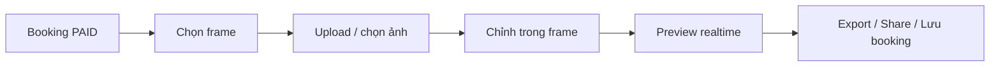
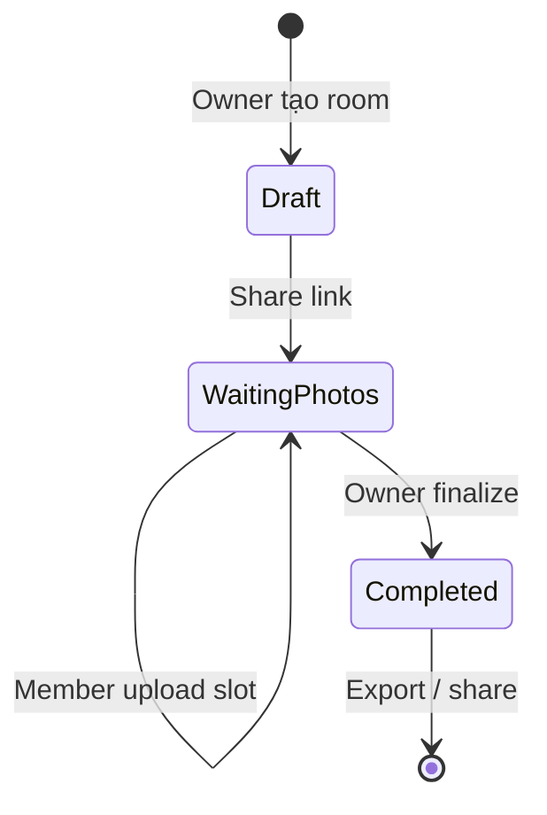

# Photobooth Creator — Product & UX/UI Spec

> **Repo:** `fao-booking` (frontend khách hàng)  
> **Ngữ cảnh:** Module mới sau booking thành công — trải nghiệm photobooth online kiểu Snow / Life4Cuts / Photoism / HaruFilm, tối ưu web/mobile, viral & share nhóm.  
> **Ràng buộc:** Không thay đổi core flow booking hiện tại. Tài liệu này mô tả **feature, UX/UI, flow, behavior** — không đi sâu backend.

---

## 1. Tổng quan

### 1.1 Mục tiêu sản phẩm

| Mục tiêu             | Mô tả                                                             |
| -------------------- | ----------------------------------------------------------------- |
| **Vui & nhanh**      | Tạo ảnh photobooth trong < 2 phút, không cần học editor           |
| **Viral**            | Export story-ready, share 1 tap, cảm giác “muốn đăng ngay”        |
| **Nhóm**             | Group photobooth — mỗi người upload slot riêng, sync realtime     |
| **Gắn booking**      | Conversion loop: booking → photobooth → share → quay lại đặt tiếp |
| **Standalone-ready** | Thiết kế đủ tách thành app/feature riêng sau này                  |

### 1.2 Điểm vào (Entry points)

Module **bổ sung**, không chặn hay thay đổi flow thanh toán / xác nhận đơn hiện tại.

| Entry          | Vị trí UI                                          | Hành vi                                                               |
| -------------- | -------------------------------------------------- | --------------------------------------------------------------------- |
| **Primary**    | `/payment-status` — sau thanh toán PAID thành công | Card nổi bật **“Tạo ảnh photobooth”** trong khu vực “Thêm (tùy chọn)” |
| **Secondary**  | `/order/:orderIdNew`, `/order/code/:orderCode`     | Section “Photobooth của bạn” — tạo mới / tiếp tục draft / xem đã lưu  |
| **Tertiary**   | `/my-bookings`                                     | Badge “Tạo photobooth” trên đơn đã PAID                               |
| **Direct**     | `/photobooth`                                      | Landing giới thiệu + CTA “Bắt đầu” (yêu cầu mã đơn hoặc đăng nhập)    |
| **Group join** | `/photobooth/room/:roomId`                         | Link public — không cần account                                       |

### 1.3 Route map (frontend)

```
/photobooth                          → Landing + hướng dẫn
/photobooth/create                   → Chọn frame (step 1)
/photobooth/create/:sessionId        → Editor (step 2–4)
/photobooth/create/:sessionId/export → Export & share (step 5)
/photobooth/room/:roomId             → Group room (join / edit)
/photobooth/room/:roomId/export      → Export nhóm
```

Query params gắn booking (không đổi route booking hiện tại):

```
/photobooth/create?orderIdNew=xxx
/photobooth/create?orderCode=xxx
```

---

## 2. User journey chính

### 2.1 Solo flow (5 bước)



| Step | Màn hình         | Thời gian mục tiêu | Exit                              |
| ---- | ---------------- | ------------------ | --------------------------------- |
| 0    | Success card CTA | —                  | Bỏ qua → flow booking bình thường |
| 1    | Frame gallery    | 15–30s             | Back → success / order            |
| 2    | Upload slots     | 20–40s             | Auto-save draft                   |
| 3    | Editor           | 30–90s             | Undo per slot                     |
| 4    | Preview          | Instant            | Toggle layout                     |
| 5    | Export           | 10s                | Share / download / print          |

### 2.2 Group flow



---

## 3. Success page — tích hợp không phá flow

### 3.1 Vị trí CTA

Thêm **một card riêng** dưới block “Thêm (tùy chọn)”, **sau** Copy đơn / Messenger (ưu tiên xác nhận đơn vẫn là primary).

```
┌─────────────────────────────────────────┐
│  ✓ Thanh toán thành công                │
│  [Copy đơn]  [Messenger]   ← giữ nguyên │
├─────────────────────────────────────────┤
│  📸 Tạo ảnh photobooth          NEW     │
│  Biến kỷ niệm thuê máy thành strip ảnh  │
│  đẹp — share story ngay!                │
│  [Bắt đầu tạo]  [Tạo phòng nhóm →]      │
└─────────────────────────────────────────┘
```

### 3.2 Behavior

- Chỉ hiện khi `status === PAID` và có `orderIdNew` hoặc `orderCode`.
- Tap **“Bắt đầu tạo”** → `/photobooth/create?orderIdNew=…` — tạo session draft local + server.
- Tap **“Tạo phòng nhóm”** → modal chọn frame nhanh → tạo room → copy link.
- Không block, không modal bắt buộc, không redirect tự động.
- Micro-copy: _“Miễn phí cho khách đã đặt đơn”_ (nếu business rule cho phép).

---

## 4. Frame system

### 4.1 Nguồn template — reuse FAO In ảnh

Tái sử dụng toàn bộ frame từ project **FAO In ảnh** (`fao` → staff `/free`):

| Thành phần reuse                  | Nguồn                                       |
| --------------------------------- | ------------------------------------------- |
| Frame PNG overlay                 | API `GET /v1/photo-booth-frames`            |
| Layout slot (`1x4`, `2x2`, `1x1`) | `FRAME_SIZE_TEMPLATES` — slot rects ratio   |
| Category                          | `PhotoBoothFrameCategory`                   |
| Theme metadata                    | `PHOTO_THEMES` (border, footer, film style) |

Mỗi frame theme có thể có **nhiều layout**:

| Layout         | Slots | Orientation | Use case          |
| -------------- | ----- | ----------- | ----------------- |
| Strip HQ `1x4` | 4     | Dọc         | Life4Cuts classic |
| Grid `2x2`     | 4     | Vuông       | Friends / couple  |
| Single `1x1`   | 1     | Dọc/ngang   | Profile / poster  |
| `1x3`          | 3     | Dọc         | Compact strip     |
| `2x1`          | 2     | Ngang       | Couple wide       |

### 4.2 Category taxonomy

Filter chips (scroll ngang):

- **Tất cả** · **Phổ biến** · **Mới**
- Minimal · Retro · Nhật/Hàn · Birthday · Couple · Friends · Travel
- Film camera · Vintage flash · Seasonal (Tết, Valentine, …)

Badge trên card:

| Badge      | Rule                                     |
| ---------- | ---------------------------------------- |
| `Popular`  | Admin set trending hoặc top usage 7 ngày |
| `New`      | Frame created < 14 ngày                  |
| `Seasonal` | Gắn campaign theo mùa                    |

### 4.3 Frame gallery UX

**Layout:** Full-screen mobile / split desktop (gallery trái, preview phải).

**Mobile — swipe gallery:**

```
┌──────────────────────────┐
│ ← Photobooth Creator     │
│ 🔍 Tìm frame...          │
│ [Tất cả][Minimal][HQ]... │  ← horizontal scroll chips
├──────────────────────────┤
│ ┌────┐ ┌────┐ ┌────┐     │
│ │ 🏷 │ │ ⭐ │ │    │ →   │  ← card carousel
│ │prev│ │prev│ │prev│     │
│ └────┘ └────┘ └────┘     │
│ Gần đây: [thumb][thumb]  │
├──────────────────────────┤
│  [Preview lớn selected]  │
│  "Snow White Minimal"    │
│  4 ảnh · Strip dọc       │
├──────────────────────────┤
│ [Tiếp tục →]  sticky     │
└──────────────────────────┘
```

**Card interaction:**

- **Idle:** Mini mockup với placeholder faces mờ + frame overlay.
- **Hover / press:** Scale 1.03, shadow tăng, mockup slot shimmer.
- **Selected:** Ring pink `#E85C9C`, checkmark góc, preview lớn cập nhật elastic.
- **Long-press mobile:** Quick preview fullscreen 0.5s.

**Filter & search:**

- Search theo `themeName`, category — debounce 300ms.
- **Recent used:** `localStorage` + server sync nếu logged in — max 8 items.
- Empty search: illustration + “Thử ‘birthday’ hoặc ‘film’”.

**Layout picker (sub-step):**

Sau chọn theme, nếu frame có nhiều URL (`frame1x4Url`, `frame2x2Url`, `frame1x1Url`):

- Bottom sheet 3 option với icon layout.
- Default: layout phổ biến nhất (1x4).

---

## 5. Photo slot UX

### 5.1 Slot states

| State           | UI                                                               |
| --------------- | ---------------------------------------------------------------- |
| **Empty**       | Dashed border, icon camera, gradient nhẹ, text “Thả ảnh vào đây” |
| **Uploading**   | Progress ring + blur thumbnail                                   |
| **Filled**      | Ảnh crop trong slot + avatar contributor (group)                 |
| **Active edit** | Ring highlight, handles zoom/rotate                              |
| **Error**       | Shake nhẹ + “Ảnh quá lớn” / “Định dạng không hỗ trợ”             |

### 5.2 Upload sources

Bottom sheet khi tap empty slot:

1. **Chụp / chọn từ máy** — `input capture="environment"` trên mobile
2. **Gallery thiết bị**
3. **Ảnh từ booking** — gallery session thuê (nếu khách đã upload ảnh feedback / attach — phase 2)
4. **Dán link** (optional phase 2)

### 5.3 Completion progress

Sticky pill trên editor:

```
●●●○  3/4 ảnh đã hoàn thành
```

- Pulse animation khi slot mới fill.
- Confetti micro khi 100% (1 lần, không lặp annoyingly).

---

## 6. Photo editor experience

### 6.1 Nguyên tắc

> Giống photobooth thật — **không** phải Photoshop.

- Một tay trên mobile, full-screen canvas.
- Mọi thao tác reflect **realtime** trên preview (< 16ms target feel).
- Controls float, không che slot đang edit.

### 6.2 Gestures & controls

| Action      | Desktop                  | Mobile                            |
| ----------- | ------------------------ | --------------------------------- |
| Pan         | Drag                     | 1 finger drag                     |
| Zoom        | Scroll wheel / slider    | Pinch                             |
| Rotate      | Handle góc / slider ±15° | Two-finger rotate                 |
| Snap center | Double-click slot        | Double-tap                        |
| Switch slot | Click slot               | Tap slot                          |
| Undo        | Ctrl+Z / button          | Shake undo (optional) hoặc button |

**Snap behavior:**

- Magnetic snap khi ảnh gần center slot (threshold 8px).
- Haptic `light` trên iOS khi snap (nếu supported).

### 6.3 Decoration panel (bottom sheet)

Tabs icon-only:

| Tab            | Options                                                                           |
| -------------- | --------------------------------------------------------------------------------- |
| **Border**     | None · Thin white · Film sprocket · Polaroid                                      |
| **Background** | Frame default · Solid pastel · Paper texture                                      |
| **Sticker**    | Bộ ~30 sticker nhỏ (tim, sao, flash, date stamp) — drag & scale                   |
| **Text**       | Handwriting fonts: Caveat, Great Vibes, Playwrite VN (đã load trong `index.html`) |

Text UX:

- Tap to add → inline edit → drag position.
- Preset màu: trắng, đen, pastel pink.
- Max 2 text layers per session (tránh clutter).

### 6.4 Realtime preview

- Canvas composite: `[bg] → [photos per slot transform] → [frame overlay] → [stickers/text]`.
- Shadow thật: `drop-shadow` multi-layer trên frame container.
- **Paper print effect:** subtle noise overlay + warm tone filter toggle.
- Transition khi đổi frame: crossfade 280ms `ease-out`.

### 6.5 Editor layout

**Mobile:**

```
┌──────────────────────────┐
│ ✕  Undo    Photobooth  ⋮ │
├──────────────────────────┤
│                          │
│     [ LIVE PREVIEW ]     │  ← 65vh, pinch zoom whole preview
│                          │
├──────────────────────────┤
│ [slot1][slot2][slot3][4] │  ← thumb strip, tap to edit
├──────────────────────────┤
│ 🖼 🎨 ✏️ 😊              │  ← decoration tabs
│ ─── zoom ─── rotate ───  │  ← active slot controls
├──────────────────────────┤
│ [Xem trước →]   sticky   │
└──────────────────────────┘
```

**Desktop:**

- Preview center 60%, sidebar phải: slots + decoration.
- Keyboard shortcuts hint tooltip lần đầu.

---

## 7. Group Photobooth (feature quan trọng)

### 7.1 Concept

Owner tạo **public room** gắn 1 frame + layout. Share link — bạn bè join **không cần account**, mỗi người claim & upload slot riêng. Owner **finalize** khi đủ ảnh.

### 7.2 Room lifecycle

| Status             | UI owner                        | UI member                |
| ------------------ | ------------------------------- | ------------------------ |
| **Draft**          | Chọn frame, chưa share          | —                        |
| **Waiting photos** | Progress bar, list participants | Pick empty slot → upload |
| **Completed**      | Export unlocked                 | View only + download     |

### 7.3 Create room flow

1. Từ success / editor → **“Mời bạn bè”**
2. Nhập tên phòng (optional): _“Team đi Đà Lạt”_
3. Chọn số người tối đa = số slot frame
4. Generate link: `faocamera.vn/photobooth/room/abc123`
5. Copy / share native (Zalo, Messenger, iMessage)

### 7.4 Join flow (guest)

1. Mở link → landing room: frame preview + “Bạn là ai?”
2. Nhập nickname + chọn avatar color (8 preset) — **không login**
3. Chọn slot trống (hoặc được owner assign)
4. Upload & chỉnh ảnh slot của mình
5. Thấy realtime: slot khác fill dần, ai đang online

### 7.5 Realtime UX (collaborative feel)

Lightweight — giống Canva/Figma mini, không nặng:

| Signal          | UI                                                  |
| --------------- | --------------------------------------------------- |
| User join       | Toast nhỏ: _“Lan vừa vào phòng”_                    |
| Slot claimed    | Avatar badge trên slot                              |
| Editing slot    | Colored ring theo user color                        |
| Cursor presence | Dot + tên ở góc slot (desktop); avatar stack mobile |
| Activity feed   | Collapsible panel góc dưới phải — 5 events gần nhất |

**Conflict:** Slot đã claim → member khác không upload được; owner có thể “Nhả slot”.

### 7.6 Owner controls

- **Finalize layout** — disabled until all slots filled (hoặc confirm “Thiếu 1 ảnh, vẫn xuất?”)
- **Kick / nhả slot**
- **Đổi frame** — chỉ khi chưa ai upload (hoặc reset cả phòng — confirm)
- **Lock room** — không nhận thêm người

### 7.7 Room UI mock

```
┌─────────────────────────────────────────┐
│ 👑 Minh (owner) · 3/4 ảnh · 🔴 Live     │
│ [Copy link] [Finalize]                  │
├─────────────────────────────────────────┤
│  ┌───┐                                    │
│  │ A │ Lan ✓     ┌───┐                   │
│  └───┘           │ B │ ← Huy đang chỉnh  │
│  ┌───┐           └───┘                   │
│  │ C │ ✓           ┌───┐                 │
│  └───┘             │ + │ Trống — vào!    │
│                    └───┘                 │
├─────────────────────────────────────────┤
│ Activity: Lan upload slot 2 · 10s trước  │
└─────────────────────────────────────────┘
```

---

## 8. Preview & Export

### 8.1 Pre-export preview

Màn hình riêng trước export — **“Ảnh in thật” feel**:

- Mockup: strip giấy trên bàn gỗ / tường pastel (CSS 3D nhẹ).
- Toggle **Story** (9:16) vs **Print** (tỉ lệ frame gốc).
- Paper texture overlay ON by default.
- Parallax tilt theo gyro mobile (optional, subtle).

### 8.2 Export formats

| Format    | Size               | Use              |
| --------- | ------------------ | ---------------- |
| **JPG**   | High quality 92%   | Share Zalo/FB    |
| **PNG**   | Transparent bg off | Archive          |
| **Story** | 1080×1920          | Instagram/TikTok |
| **Print** | 300 DPI equivalent | Đặt in tại shop  |

### 8.3 Export actions

Sticky bottom bar:

```
[⬇ Tải về]  [🔗 Chia sẻ link]  [💾 Lưu vào đơn]  [🖨 Đặt in]
```

| Action           | Behavior                                                      |
| ---------------- | ------------------------------------------------------------- |
| **Tải về**       | Trigger download + haptic success                             |
| **Chia sẻ link** | Public view-only URL, OG image = preview                      |
| **Lưu vào đơn**  | Gắn `orderIdNew` — hiện trong order detail                    |
| **Đặt in**       | Deep link form in ảnh / Messenger shop (phase 1: CTA mở chat) |

**Share sheet native:** prefill text _“Vừa tạo photobooth với FAO 📸”_ + link.

### 8.4 Post-export delight

- Flash animation mimicking booth print (strip trượt ra).
- CTA secondary: **“Tạo thêm frame khác”** · **“Thuê máy chụp thật →”** link `/catalog`.

---

## 9. Booking integration

### 9.1 Data gắn kết (conceptual)

| Field                      | Mục đích                              |
| -------------------------- | ------------------------------------- |
| `orderIdNew` / `orderCode` | Liên kết session photobooth ↔ booking |
| `bookingId`                | Optional per-device booking           |
| `customerSessionId`        | Anonymous tracking                    |

### 9.2 Order detail — section mới

```
Photobooth của bạn
┌────────┐ ┌────────┐
│ strip1 │ │ strip2 │  ← thumbnails saved
└────────┘ └────────┘
[+ Tạo mới]  [Tiếp tục nháp]
```

- **Re-edit:** mở lại editor với state đã lưu.
- **Share từ đơn:** 1 tap share link photobooth public.

### 9.3 Ảnh từ session booking

Phase 1: placeholder “Sắp có — dùng ảnh bạn chụp khi thuê máy”.  
Phase 2: pull gallery nếu khách upload feedback ảnh / staff attach ảnh checkout.

---

## 10. Mobile-first UX

### 10.1 Patterns

| Pattern                | Application                            |
| ---------------------- | -------------------------------------- |
| **Sticky bottom CTA**  | Mọi step: primary action thumb-zone    |
| **Bottom sheet**       | Upload source, decoration, layout pick |
| **Full-screen editor** | Ẩn browser chrome feel, `100dvh`       |
| **Swipe frame select** | Horizontal carousel + snap             |
| **One-hand reach**     | Controls trong 40% dưới màn hình       |
| **Safe area**          | `env(safe-area-inset-bottom)`          |

### 10.2 Performance feel

- Skeleton loading frame gallery.
- Optimistic UI khi upload (blur placeholder → sharp).
- Prefetch frame PNG khi hover / swipe next.
- Export: loading strip animation, không block UI.

### 10.3 Touch targets

- Minimum 44×44px.
- Spacing giữa slot thumbs ≥ 8px.

---

## 11. UI style guide

### 11.1 Design direction

**Minimal Hàn Quốc** — align với FAO Booking hiện tại nhưng “premium photobooth”:

| Token        | Value                                   |
| ------------ | --------------------------------------- |
| Primary      | `#E85C9C` (pink FAO)                    |
| Surface      | `#FFFFFF`, `#FDF2F8`                    |
| Text primary | `#831843` / slate-800                   |
| Text muted   | slate-500                               |
| Radius       | `rounded-2xl` cards, `rounded-3xl` hero |
| Shadow       | `shadow-lg shadow-pink-500/10`          |
| Blur         | `backdrop-blur-md` nav overlay          |

### 11.2 Typography

| Role                   | Font                              |
| ---------------------- | --------------------------------- |
| UI / body              | System + Quicksand (existing)     |
| Handwriting text layer | Caveat, Great Vibes, Playwrite VN |
| Display / titles       | Bold black, tracking tight        |

### 11.3 Motion catalog

| Animation    | Spec                                     |
| ------------ | ---------------------------------------- |
| Page enter   | `opacity 0→1`, `y 16→0`, 450ms ease-out  |
| Card hover   | scale 1.03, shadow deepen, 200ms         |
| Frame select | spring stiffness 220                     |
| Slot fill    | scale pop 0.95→1, 300ms spring           |
| Bottom sheet | slide up + backdrop fade 280ms           |
| Export print | strip translateY + fade sequential 600ms |
| Progress     | width transition 400ms ease              |
| Elastic drag | rubber-band at crop bounds               |

**Easing:** prefer `ease-out` enter, `ease-in-out` interactive.

### 11.4 Empty & error states

- Empty gallery: illustration camera + “Frame mới sắp cập nhật”.
- Room expired: friendly _“Phòng này đã đóng — tạo phòng mới?”_
- Offline: banner + local draft vẫn edit được, sync khi online.

---

## 12. Admin side (tóm tắt)

Reuse admin **FAO In ảnh** (`/admin/photo-booth-frame`) — bổ sung field UI:

| Admin action     | UX                                                 |
| ---------------- | -------------------------------------------------- |
| Upload frame mới | 3 layout URL + preview                             |
| Tag category     | Multi-select                                       |
| Set trending     | Toggle → badge Popular                             |
| Seasonal         | Date range → auto badge                            |
| Analytics        | Bảng: frame ID, lượt dùng 7d/30d, conversion share |

Không mô tả chi tiết API admin — xem entity `PhotoBoothFrame` hiện có.

---

## 13. Analytics events (frontend)

Gợi ý track qua `bookingAnalytics` (không block UX):

| Event                         | Trigger                  |
| ----------------------------- | ------------------------ |
| `PHOTOBOOTH_CTA_CLICK`        | Tap CTA từ success/order |
| `PHOTOBOOTH_FRAME_SELECT`     | Chọn frame               |
| `PHOTOBOOTH_SESSION_COMPLETE` | Export thành công        |
| `PHOTOBOOTH_SHARE`            | Share / copy link        |
| `PHOTOBOOTH_ROOM_CREATE`      | Tạo group room           |
| `PHOTOBOOTH_ROOM_JOIN`        | Guest join               |

Meta: `orderIdNew`, `frameId`, `layoutType`, `isGroup`, `exportFormat`.

---

## 14. Screen inventory & component map

### 14.1 Pages

| Screen       | Route                                  |
| ------------ | -------------------------------------- |
| Landing      | `/photobooth`                          |
| Frame picker | `/photobooth/create`                   |
| Editor       | `/photobooth/create/:sessionId`        |
| Export       | `/photobooth/create/:sessionId/export` |
| Group room   | `/photobooth/room/:roomId`             |

### 14.2 Components (gợi ý tách)

```
src/features/photobooth/
├── components/
│   ├── FrameGallery.jsx          # scroll + filter + search
│   ├── FrameCard.jsx             # hover + badges
│   ├── LayoutPickerSheet.jsx
│   ├── PhotoSlot.jsx             # empty/filled states
│   ├── SlotStrip.jsx             # thumb navigation
│   ├── PhotoboothCanvas.jsx      # composite preview
│   ├── EditorToolbar.jsx         # zoom/rotate/border
│   ├── DecorationSheet.jsx       # sticker/text/bg
│   ├── ExportPreview.jsx         # mockup print
│   ├── ShareActions.jsx
│   ├── GroupRoom.jsx
│   ├── ParticipantAvatar.jsx
│   ├── ActivityFeed.jsx
│   └── PhotoboothCTA.jsx         # success page card
├── hooks/
│   ├── usePhotoboothSession.js
│   ├── useFrameCatalog.js        # wrap /v1/photo-booth-frames
│   ├── useSlotEditor.js          # transform state per slot
│   └── useGroupRoom.js           # realtime presence
├── utils/
│   ├── frameMapper.js            # API → FRAME_SIZE_TEMPLATES
│   ├── composeExport.js          # canvas → blob
│   └── recentFrames.js           # localStorage
└── constants/
    ├── categories.js
    └── exportPresets.js
```

### 14.3 State model (client)

```typescript
// Reference shape — không bắt buộc TS
PhotoboothSession {
  id, orderIdNew?, orderCode?
  frameId, layoutType           // "1x4" | "2x2" | "1x1"
  status: "draft" | "ready" | "exported"
  slots: Slot[]
  decorations: { stickers[], texts[], border, background }
  groupRoomId?
  createdAt, updatedAt
}

Slot {
  index, photoUrl?, transform: { x, y, scale, rotation }
  contributor?: { nickname, color, avatarUrl? }
}
```

Auto-save: debounce 2s → localStorage + PATCH session API.

---

## 15. Accessibility & i18n

- Alt text cho frame preview: `themeName + layout`.
- Focus trap trong bottom sheet.
- Reduce motion: respect `prefers-reduced-motion` — tắt parallax & confetti.
- Copy tiếng Việt thân thiện, gen Z nhẹ: _“Chụt chụt”_, _“Share liền tay”_ — không quá slang.

---

## 16. Phased rollout

| Phase      | Scope                                                                             |
| ---------- | --------------------------------------------------------------------------------- |
| **P0 MVP** | Solo flow, frame gallery, editor cơ bản, export JPG/Story, CTA success, lưu local |
| **P1**     | Lưu vào booking, order detail section, recent frames                              |
| **P2**     | Group room + realtime                                                             |
| **P3**     | Stickers/text, print order CTA, ảnh từ booking gallery                            |
| **P4**     | Standalone `/photobooth` marketing, seasonal campaigns                            |

---

## 17. Success metrics

| Metric                                       | Target           |
| -------------------------------------------- | ---------------- |
| CTR CTA success → create                     | > 15%            |
| Complete rate (create → export)              | > 60%            |
| Share rate post-export                       | > 40%            |
| Group room avg participants                  | > 2.5            |
| Re-booking within 30 days (photobooth users) | +10% vs baseline |

---

## 18. Tham chiếu codebase

| Asset                      | Path                                              |
| -------------------------- | ------------------------------------------------- |
| Placeholder page           | `fao-booking/src/page/photobooth/index.jsx`       |
| Success / payment          | `fao-booking/src/page/success/index.jsx`          |
| Order detail               | `fao-booking/src/page/order-info/index.jsx`       |
| Frame API consumer (staff) | `fao/src/pages/staff/free-device/index.jsx`       |
| Slot layout constants      | `fao/src/pages/staff/free-device/constants.js`    |
| Frame admin                | `fao/src/pages/admin/photo-booth-frame/index.jsx` |
| Backend frames             | `GET /v1/photo-booth-frames`                      |

---

_Tài liệu này là source of truth cho UI/UX Photobooth Creator. Mọi thay đổi core booking flow phải được review riêng — module này chỉ **additive**._
